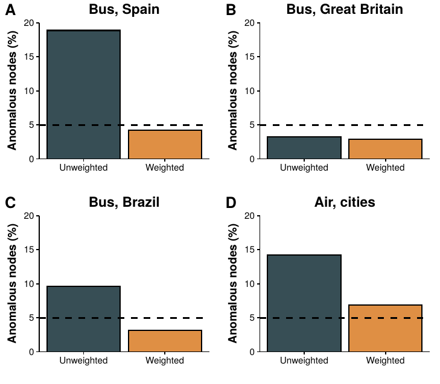

# My Thesis' plots

In this repository you can find the R scripts to produce most of the plots of my (Thesis)["Temporary placeholder"] (a few of them where done manually with inkscape, gephi...). This would have been completely impossible without the collective mind known as stackoverflow. This is my way of giving back the community, feel free to use them whoever you like!

I like to experiment with new ways of visualizing information. Thus, you will see very different types of graphs. I am not an expert in visualization at all, but I am working on improving my skills (any advice will be wecolmed!).

The data is not included because of their size, but I hope that the scripts can still be useful. 

The structure is as follows:

- There is a theme.R file in the parent folder that contains the general style that the scripts will use. This way all the plots will have the same theme, improving the visual flow of the paper.

- If the theme is modified, all scripts should be executed again to update their theme. The small script "zcript_run.R" handles that. This is obviously not portable, but it might give you an idea of how to do this.
 
## Some examples:

## Thanks

Many thanks to these great libraries:

- ggplot2
- cowplot
- ggthemes
- ggsci

and many others! Hopefully, I will soon be able to add some minor contributions to them.

## License

[unlicense](./LICENSE)
